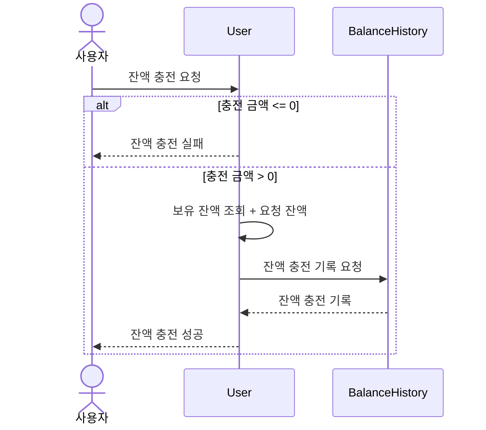
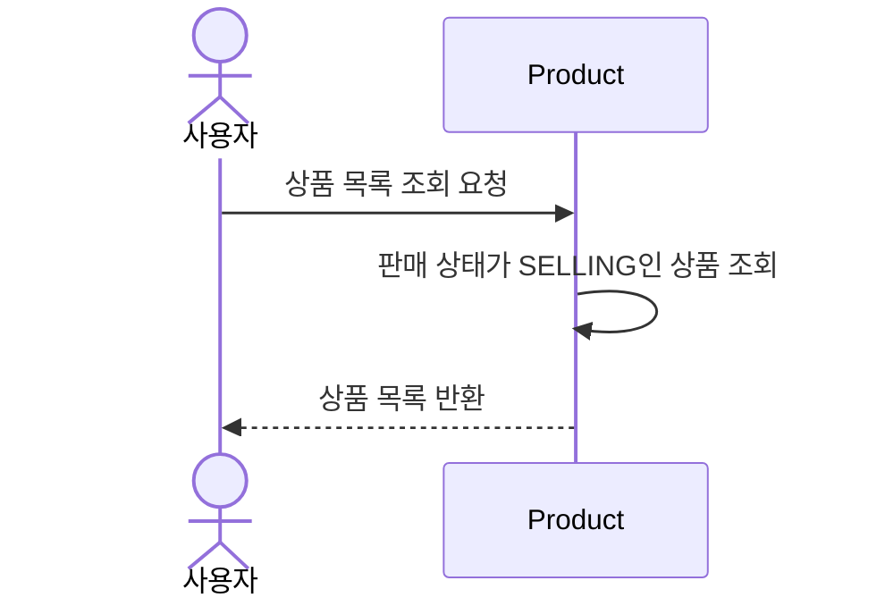
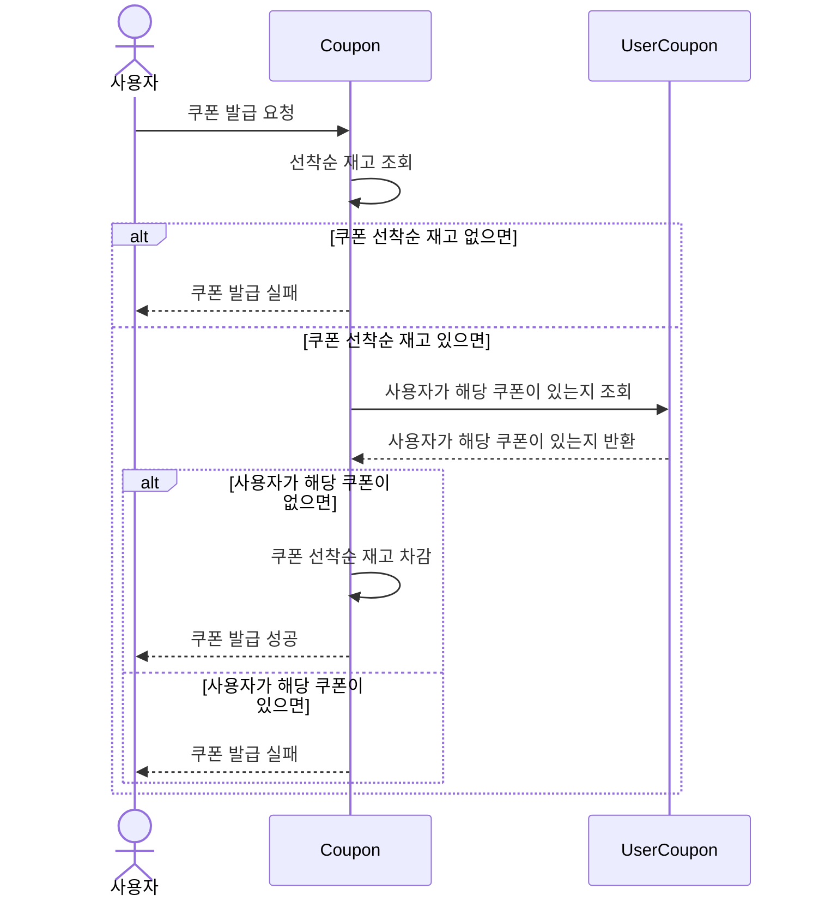
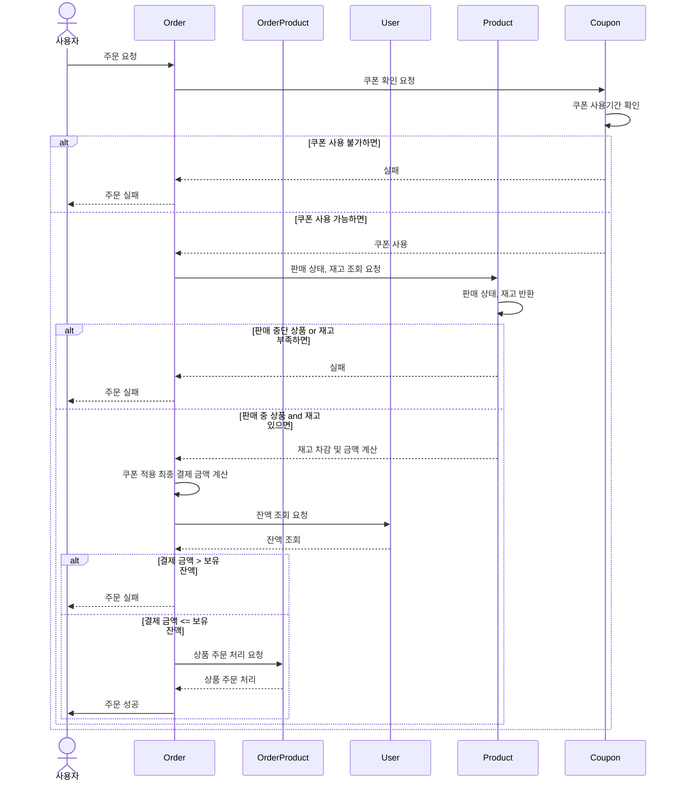
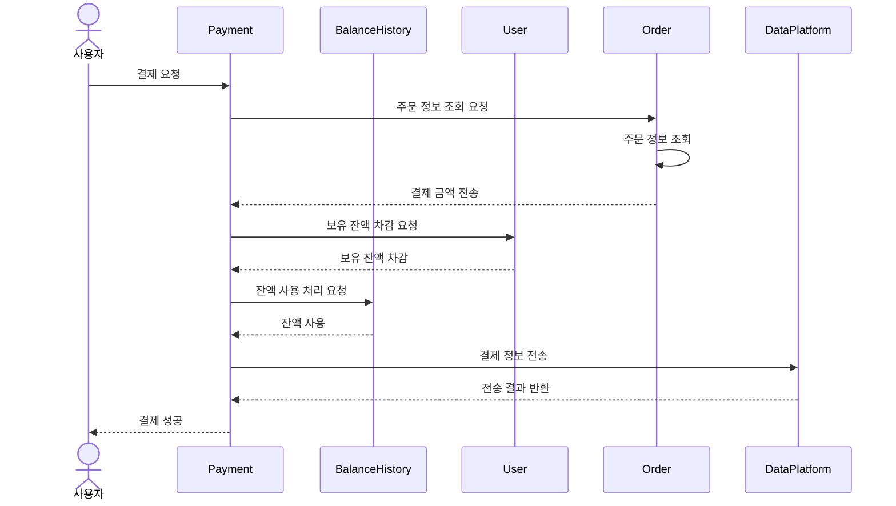
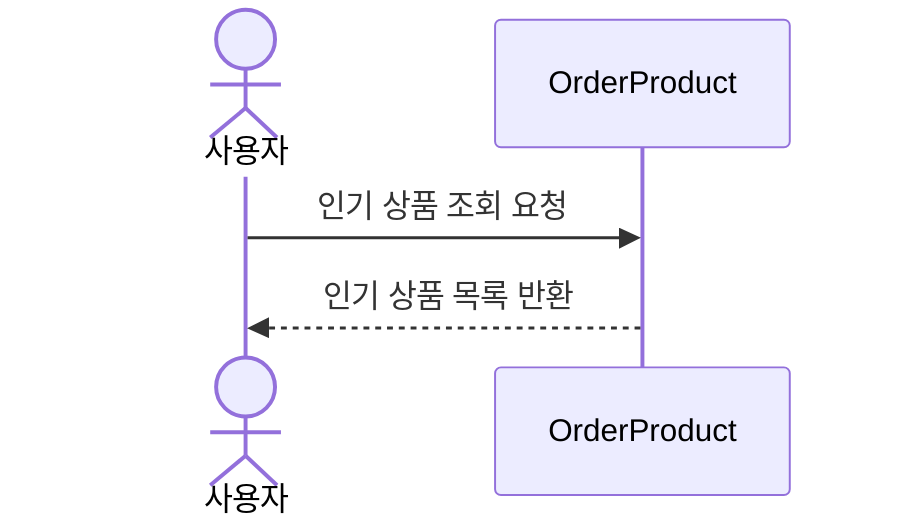

# 시퀀스 다이어그램

---

## 1. 잔액 충전

```mermaid
sequenceDiagram
    actor I as 사용자
    participant User as User
    participant BalanceHistory as BalanceHistory

    I ->> User : 잔액 충전 요청
    alt 충전 금액 <= 0
        User -->> I : 잔액 충전 실패 
    else 충전 금액 > 0
        User ->> User : 보유 잔액 조회 + 요청 잔액
        User ->> BalanceHistory : 잔액 충전 기록 요청
        BalanceHistory -->> User : 잔액 충전 기록
        User -->> I : 잔액 충전 성공
    end
    
```

## 2. 상품 조회

```mermaid
sequenceDiagram
    actor I as 사용자
    participant Product as Product

    I ->> Product : 상품 목록 조회 요청
    Product ->> Product : 판매 상태가 SELLING인 상품 조회
    Product -->> I : 상품 목록 반환
    
```

## 3. 쿠폰 발급

```mermaid
sequenceDiagram
    actor I as 사용자
    participant Coupon as Coupon
    participant UserCoupon as UserCoupon

    I ->> Coupon : 쿠폰 발급 요청
    Coupon ->> Coupon : 선착순 재고 조회
    alt 쿠폰 선착순 재고 없으면
        Coupon -->> I : 쿠폰 발급 실패
    else 쿠폰 선착순 재고 있으면
        Coupon ->> UserCoupon : 사용자가 해당 쿠폰이 있는지 조회
        UserCoupon -->> Coupon : 사용자가 해당 쿠폰이 있는지 반환
        alt 사용자가 해당 쿠폰이 없으면
            Coupon ->> Coupon : 쿠폰 선착순 재고 차감
            Coupon -->> I : 쿠폰 발급 성공
        else 사용자가 해당 쿠폰이 있으면
            Coupon -->> I : 쿠폰 발급 실패
        end
    end
```

## 4. 주문

```mermaid
sequenceDiagram
    actor I as 사용자
    participant Order as Order
    participant OrderProduct as OrderProduct
    participant User as User
    participant Product as Product
    participant Coupon as Coupon

    I ->> Order : 주문 요청
    Order ->> Coupon : 쿠폰 확인 요청
    Coupon ->> Coupon : 쿠폰 사용기간 확인
    alt 쿠폰 사용 불가하면
        Coupon -->> Order : 실패
        Order -->> I : 주문 실패
    else 쿠폰 사용 가능하면
        Coupon -->> Order : 쿠폰 사용
        Order ->> Product : 판매 상태, 재고 조회 요청
        Product ->> Product : 판매 상태, 재고 반환
        alt 판매 중단 상품 or 재고 부족하면
            Product -->> Order : 실패
            Order -->> I : 주문 실패
        else 판매 중 상품 and 재고 있으면
            Product -->> Order : 재고 차감 및 금액 계산
            Order ->> Order : 쿠폰 적용 최종 결제 금액 계산
            Order ->> User : 잔액 조회 요청
            User -->> Order : 잔액 조회
            alt 결제 금액 > 보유 잔액
                Order -->> I : 주문 실패
            else 결제 금액 <= 보유 잔액
                Order ->> OrderProduct : 상품 주문 처리 요청
                OrderProduct -->> Order : 상품 주문 처리
                Order ->> I : 주문 성공
            end
        end
    end
    
```

## 5. 결제

```mermaid
sequenceDiagram
    actor I as 사용자
    participant Payment as Payment
    participant BalanceHistory as BalanceHistory
    participant User as User
    participant Order as Order
    participant DataPlatform as DataPlatform

    I ->> Payment : 결제 요청
    Payment ->> Order : 주문 정보 조회 요청
    Order ->> Order : 주문 정보 조회
    Order -->> Payment : 결제 금액 전송
    Payment ->> User : 보유 잔액 차감 요청
    User -->> Payment : 보유 잔액 차감
    Payment ->> BalanceHistory : 잔액 사용 처리 요청
    BalanceHistory -->> Payment : 잔액 사용
    Payment ->> DataPlatform : 결제 정보 전송
    DataPlatform -->> Payment: 전송 결과 반환
    Payment -->> I : 결제 성공
```

## 6. 인기 상품 조회

```mermaid
sequenceDiagram
    actor I as 사용자
    participant OrderProduct as OrderProduct

    I ->> OrderProduct : 인기 상품 조회 요청
    OrderProduct -->> I : 인기 상품 목록 반환
```