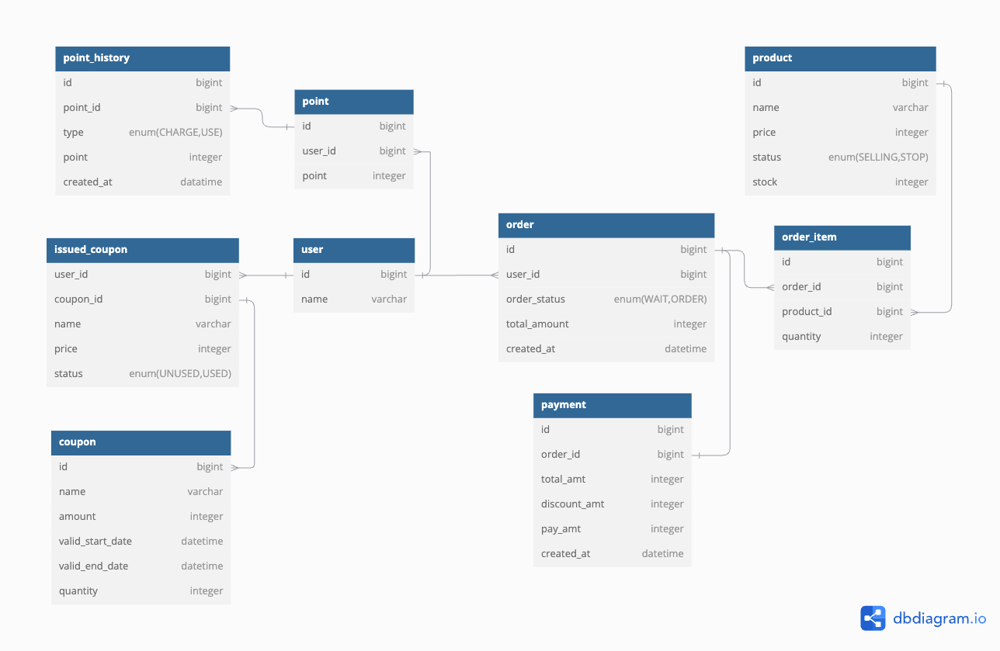

# ERD

---

- **user** : 사용자 정보를 저장합니다.

- **balance_history** : 사용자의 잔액 변동 내역을 기록합니다.

- **coupon** : 할인 쿠폰 정보를 저장합니다.

- **user_coupon** : 특정 사용자가 보유한 쿠폰 정보를 관리합니다.

- **product** : 상품 정보를 저장합니다.

- **order** : 사용자의 주문 정보를 저장합니다.

- **order_product** : 특정 주문의 상품 정보를 저장합니다.

- **payment** : 주문에 대한 결제 내역을 관리합니다.
