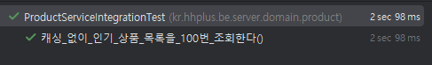
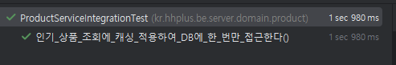

# 캐시를 활용한 성능 개선 보고서

---

## 목차
1. [개념](#1-개념)
2. [캐시 전략](#2-캐시-전략)
   - [Cache Aside (Look Aside)](#21-cache-aside-look-aside)
   - [Read Through](#22-read-through)
   - [Write Through](#23-write-through)
   - [Write Behind (Write Back)](#24-write-behind-write-back)
   - [Write Around](#25-write-around)
3. [캐시 스탬피드(Cache Stampede) 현상](#3-캐시-스탬피드cache-stampede-현상)
4. [e-commerce 서비스에 캐시 적용](#4-e-commerce-서비스에-캐시-적용)

---
## 1. 개념
- **캐시**는 자주 사용되거나 접근이 빈번한 데이터를 보다 빠르게 제공하기 위해 저장하는 임시 저장소이다.
- 주로 메모리(RAM)를 사용해 DB보다 빠른 응답 속도를 제공한다.
- 자주 조회되는 데이터를 캐시에 저장해 DB 부하를 줄이고 성능을 높인다.

---
## 2. 캐시 전략
캐시 전략은 어떻게 데이터를 캐시에 저장하고, 유지하며, 갱신할지를 결정하는 정책을 의미한다.
캐시는 응답 속도를 높이고, DB 부하를 줄이며, 시스템의 성능을 최적화하는 데 사용된다.

캐시는 성능 향상을 위한 중요한 기술이지만, 잘못된 캐시 전략을 사용하면 오히려 성능 저하나 데이터 일관성이 깨질 수 있다.
따라서 상황에 맞게 고려하여 적절한 캐시 전략을 선택하는 것이 중요하다.


### 2.1 Cache Aside (Look Aside)
1. 애플리케이션이 캐시에 데이터 조회를 시도한다.
2. 캐시에 데이터가 있으면 즉시 반환한다.
3. 캐시에 데이터가 없으면 DB에서 데이터를 조회하고, 해당 데이터를 캐시에 저장한 후 애플리케이션에 반환한다.

- 캐시는 단순히 **일시적 저장소**로 동작하며, DB와의 동기화 로직을 애플리케이션이 직접 제어한다.
- 캐시 서버에 장애가 생기면 **애플리케이션은 바로 DB에 접근**해 데이터를 가져올 수 있으므로 서비스 전체 장애로 이어지지 않는다.
- **Cache Warming (미리 캐시에 데이터를 적재)** 기법을 사용하면, 데이터 접근이 많을 때 DB 부하를 완화할 수 있다.
- 뉴스 기사, 블로그 게시글 등 읽기 트래픽이 많고, 업데이트가 비교적 적은 시스템에 적합하다.


### 2.2 Read Through
1. 애플리케이션이 캐시에게 데이터를 요청한다.
2. 캐시에 데이터가 있으면 즉시 반환한다.
3. 캐시에 데이터가 없으면 **캐시가 직접** DB에 접근하여 데이터를 가져오고, 가져온 데이터를 캐시에 저장한 후 애플리케이션에게 데이터를 반환한다.

- 캐시에서 DB 접근 로직을 내부적으로 처리하므로, 애플리케이션은 캐시만 바라보면 된다.
- 캐시와 DB 간의 연동을 캐시 시스템이 담당하기 때문에, **캐시 시스템이 DB 연동에 대한 제어권**을 갖는다.
- 캐시 서버에 장애가 생기면 **데이터를 읽을 수 없게 될 위험**이 있다.


### 2.3 Write Through
1. 애플리케이션이 데이터 쓰기(갱신) 요청을 캐시에 보낸다.
2. 캐시는 해당 변경 사항을 캐시에 먼저 반영하고, 동시에 DB에도 반영한다.
3. 쓰기 작업이 완료되면, 캐시는 결과를 애플리케이션에 전달한다.

- 캐시가 DB 쓰기 작업을 대행하기에 애플리케이션에서 DB와 직접 소통하는 로직을 최소화할 수 있다.
- 캐시와 DB가 즉시 동기화되므로, 최신 데이터가 캐시에 반영되어 있어 **데이터 일관성**을 유지할 수 있다.
- 캐시 서버에 장애가 생기면 **DB에 대한 쓰기도 함께 실패**할 수 있다.
- 금융/결제/재고 시스템 등과 같이 **데이터 무결성**과 **최신성**이 매우 중요한 환경에 적합하다.


### 2.4 Write Behind (Write Back)
1. 애플리케이션이 데이터를 쓰기(갱신) 요청하면, 캐시는 캐시에만 먼저 갱신하고 애플리케이션에 즉시 성공 응답을 보낸다.
2. 캐시가 일정 시간 후 또는 특정 조건이 충족되면 비동기적으로 DB를 업데이트한다.
3. DB 반영 시점 전까지는 캐시에만 최신 데이터가 들어 있고, DB는 잠시 구버전 데이터를 가질 수 있다.

- 비동기 쓰기이므로 애플리케이션 입장에서는 쓰기 응답 시간이 매우 빠르다.
- 한 번에 여러 변경을 모아서 DB에 적용할 수 있어, DB 과부하를 줄일 수 있다.
- 캐시 서버에 장애가 발생하거나, 반영 전에 캐시가 재시작되면 **데이터 유실** 가능성이 있다.
- **쓰기 빈도는 높지만 즉시 일관성이 덜 중요한 경우**에 적용해볼 수 있다.


### 2.5 Write Around
1. 애플리케이션이 데이터 쓰기(갱신) 요청을 보내면, 캐시를 거치지 않고 DB에 직접 저장한다.
2. 캐시는 갱신되지 않으며, 기존 캐시 데이터를 그대로 유지한다.
3. 이후 애플리케이션에서 데이터를 조회할 때(Cache Miss 발생 시), DB에서 최신 데이터를 가져와 캐시에 저장한 후 반환한다.

- 캐시에 쓰기 부하를 최소화할 수 있으며, 캐시는 읽기 요청에만 사용된다.
- 자주 변경되는 데이터의 경우, 매번 캐시를 갱신하는 대신 DB에만 저장하므로 캐시 오버헤드는 감소된다.
- 쓰기 이후 즉시 반영되지 않으므로 최신 데이터가 캐시에 반영되기까지 지연이 발생한다.
- 실시간 로그, 주문 내역, 이벤트 기록 등 **쓰기 빈도가 높고, 특정 시점 이후에는 조회 요청**이 많은 데이터에 적합하다.

---
## 3. 캐시 스탬피드(Cache Stampede) 현상
- 모든 키에 대해 만료 시간을 동일하게 설정하는 경우, 많은 양의 요청이 동시에 DB에 접근하여 서버에 과부하를 일으킬 수 있다.
- 특정 인기 상품 페이지의 캐시가 만료되었을 때, 갑자기 들어온 많은 양의 요청이 모두 DB를 조회하려 하면 DB에 과부하가 걸리고, 이는 서비스 장애로 이어질 수 있다.
- 이를 방지하기 위해서 시 만료 시간을 무작위로 설정하여 동시에 만료되지 않도록 조정하거나,  동일한 키에 대해 하나의 요청만 DB에 접근하도록 제어하는 등의 방법이 있다.


---
## 4. e-commerce 서비스에 캐시 적용
e-commerce 시나리오에서 **인기 상품 조회** 서비스에 캐시를 적용해보았습니다.

인기상품 조회 서비스는 **읽기 요청이 많고, 실시간 정확성보다 속도가 중요한 경우**가 많기 때문에 캐시를 적용하면 성능을 최적화하면서도 DB 부하를 줄이고, 비용을 절감하며, 서비스 안정성을 확보할 수 있습니다.
```java
@Cacheable("popular_products")
public List<ProductInfo.PopularProduct> popularProducts() {
    return productRepository.findPopularProducts();
}
```

```java
@Scheduled(cron = "0 0 0 * * *")
@CachePut("popular_products")
public void cachePopularProducts() {
    productService.popularProducts();
}
```
매일 00시에 배치가 실행되어 ```@CachePut```을 사용하여 기존 캐시 데이터를 최신 데이터로 새로 갱신할 수 있도록 적용했습니다.

```java
@Test
void 캐시_없이_인기_상품_목록을_100번_조회한다() {
    // when
    for (int i = 0; i < 100; i++) {
        productService.popularProducts();
    }

    // then
    verify(productRepository, times(100)).findPopularProducts();
}
```


```java
@Test
void 인기_상품_조회에_캐시_적용하여_DB에_한_번만_접근한다() {
    // given
    cacheManager.getCache("popular_products").clear();

    // when
    for (int i = 0; i < 100; i++) {
        productService.popularProducts();
    }

    // then
    verify(productRepository, times(1)).findPopularProducts();
}
```


인기 상품 조회 서비스를 100번 호출하는 성능 테스트를 진행한 결과, 캐시를 적용했을 때 응답 속도가 향상됨을 확인하였습니다.<br>
요청 수가 증가할 경우 캐시 적용 여부에 따른 응답 속도 차이가 더욱 커질 것으로 예상됩니다.<br>
이를 통해 캐시 적용이 대량 트래픽 환경에서 시스템 성능을 개선하는 데 중요한 역할을 한다는 것을 알 수 있었습니다.